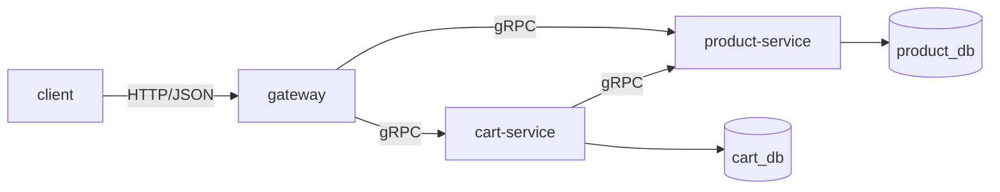

# ec-microservices

`microservices` `gRPC` `k8s`

## アーキテクチャ


```mermaid
flowchart LR
    client -->|HTTP/JSON| gateway

    gateway -->|gRPC| product-service
    gateway -->|gRPC| cart-service
    cart-service -->|gRPC| product-service

    product-service --> product_db[(product_db)]
    cart-service --> cart_db[(cart_db)]
```

## セットアップ

```bash
docker compose up -d mysql
make migrate
make start
```
